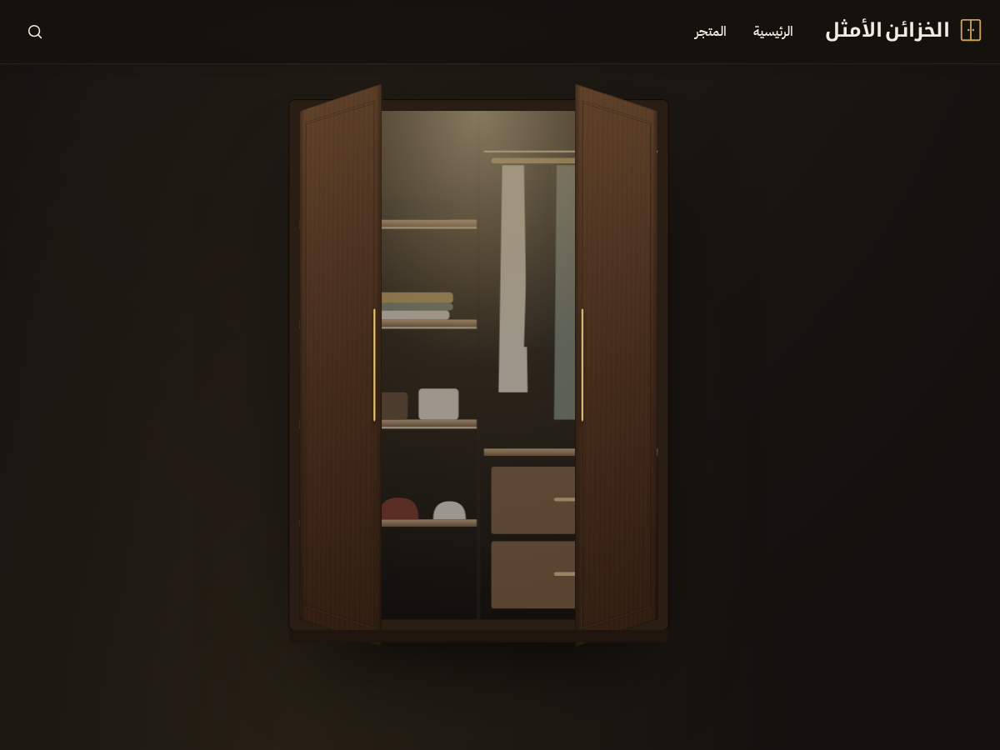

# قالب متجر الخزائن الأمثل

قالب ووردبريس وووكومرس مخصص لمتجر [الخزائن الأمثل](https://optimum-closets.com/)، بتصميم عربي سينمائي فاخر من اليمين لليسار، ومصمم للجوال أولاً.



## ماذا يقدم القالب

**تجربة استثنائية**
- **خزانة تنفتح مع التمرير:** يدخل العميل فيجد خزانة خشبية مغلقة، ومع التمرير تنفتح أبوابها ويضيء داخلها، ثم تظهر رسالتكم. ارفع صورة من أعمالكم لتظهر خلف الأبواب
- **مصمم الخزانة التفاعلي:** يختار العميل العرض والارتفاع ونوع الأبواب (مفصلية، سحّابة، مفتوحة) واللون والمقابض والإضافات، ويضغط على أي قسم داخلي ليغيّر توزيعه (تعليق، رفوف، أدراج...). يرى خزانته تتشكل أمامه مفتوحة ومغلقة، ثم يرسل التصميم كاملاً إليكم عبر واتساب بضغطة
- سعر تقديري اختياري يظهر أثناء التصميم إذا ضبطت سعر المتر المربع
- قائمة مجموعات بخط كبير، تتبع فيها صورة القسم مؤشر الفأرة
- شريط كلمات متحرك، وأقسام تظهر تدريجياً مع التمرير
- المصمم متاح أيضاً في صفحة مستقلة (قالب صفحة «مصمم الخزانة») أو في أي صفحة بالكود المختصر `[optimum_configurator]`

**تجربة الشراء**
- زر واتساب عائم في كل الصفحات
- زر **«اطلب أو استفسر عبر واتساب»** في كل منتج، برسالة جاهزة فيها اسم المنتج ورابطه
- شارات ثقة تحت زر الشراء (توصيل وتركيب، ضمان، دفع آمن، دعم)
- شريط **«أضف X ريال واحصل على توصيل مجاني»** في السلة وصفحة الدفع
- شارة الخصم بالنسبة المئوية (خصم 15٪) بدلاً من «تخفيض!»
- شريط شراء ثابت أسفل الشاشة على الجوال في صفحة المنتج
- صفحة دفع أبسط: حذف حقل الشركة والعنوان الثاني، والرمز البريدي اختياري
- قائمة جوال منزلقة، وبحث في المنتجات، وعدد السلة يتحدث تلقائياً
- فلاتر المتجر في لوحة جانبية على الجوال

**الأداء والجودة**
- بدون مكتبات ثقيلة: الخزانة والمصمم مرسومان بالكود (CSS و SVG) بدون صور أو مكتبات ثلاثية الأبعاد، وجافاسكربت خفيف بدون jQuery
- لا يعتمد على Elementor أو إضافات أخرى
- متوافق مع قارئات الشاشة ولوحة المفاتيح. ومن فعّل «تقليل الحركة» في جهازه يرى الخزانة مفتوحة مباشرة بلا حركة

## التثبيت

1. حمّل الملف المضغوط `optimum-closets.zip` (أو أنشئه بالأمر `./build.sh`)
2. **خذ نسخة احتياطية من موقعك أولاً** (من الاستضافة أو بإضافة مثل UpdraftPlus)
3. من لوحة ووردبريس: **المظهر ← القوالب ← أضف جديد ← رفع قالب**، واختر الملف
4. اضغط **معاينة مباشرة** قبل التفعيل لترى الشكل مع منتجاتك الحقيقية، ثم **تفعيل**

> نصيحة: جرّب القالب أولاً على نسخة تجريبية من الموقع (Staging) إن كانت استضافتك توفرها.

## الإعداد بعد التفعيل (10 دقائق)

من **المظهر ← تخصيص ← إعدادات الخزائن الأمثل**:

| القسم | ما تضبطه |
|---|---|
| التواصل وواتساب | **رقم الواتساب** بالصيغة الدولية (مثل `9665XXXXXXXX`). بدونه لن تظهر أزرار واتساب |
| الصفحة الرئيسية: الواجهة | العبارة الأولى على الأبواب، والعنوان والوصف، و**صورة حقيقية من أعمالكم تظهر خلف الأبواب** (يفضل عمودية) |
| مصمم الخزانة التفاعلي | العنوان والوصف، و**سعر المتر المربع** لإظهار سعر تقديري (ضع 0 لإخفائه) |
| قسم التفصيل | عنوان ووصف قسم «كيف نعمل»، وصورة عريضة اختيارية من أعمالكم |
| الأسئلة الشائعة | اكتب الإجابات الحقيقية. **لا يظهر السؤال حتى تكتب إجابته** |
| المتجر والشحن | حد التوصيل المجاني، ويجب أن يطابق إعداد الشحن في ووكومرس. ونصوص شارات الثقة |
| التذييل | نبذة عن المتجر، ووسائل الدفع، وروابط التواصل الاجتماعي |
| الألوان | الألوان الثلاثة الأساسية لتطابق شعاركم |

ومن **المظهر ← تخصيص ← هوية الموقع** ارفع الشعار.

ثم:
- **القوائم:** من المظهر ← القوائم، أنشئ «القائمة الرئيسية» وأضف إليها أقسام المنتجات
- **صور الأقسام:** من المنتجات ← التصنيفات، أضف صورة لكل تصنيف لتظهر في الصفحة الرئيسية
- **صفحة مستقلة للمصمم (اختياري):** من الصفحات ← أضف جديدة، ثم اختر من «القالب» في إعدادات الصفحة: **مصمم الخزانة**، وأضفها للقائمة
- **الفلاتر (اختياري):** من المظهر ← الودجات، أضف ودجات ووكومرس إلى منطقة «فلاتر المتجر»

> ⚠️ راجع نصوص المزايا وشارات الثقة (مثل «توصيل وتركيب» و«ضمان على المنتج») وعدّلها لتطابق خدماتكم الفعلية.

## ملاحظة عن الصفحة الرئيسية

القالب يعرض صفحته الرئيسية المصممة تلقائياً، حتى لو كانت عندك صفحة رئيسية مبنية بمحرر آخر. آراء العملاء تُسحب من **تقييمات المنتجات الحقيقية** (4 نجوم فأكثر)، ولا يظهر القسم إن لم توجد تقييمات بعد.

## هيكل الملفات

```
optimum-closets/
├── style.css              بيانات القالب
├── functions.php          نقطة الدخول
├── inc/
│   ├── setup.php          الدعم والقوائم والأنماط
│   ├── customizer.php     كل الإعدادات القابلة للتعديل
│   ├── template-tags.php  الأيقونات وروابط واتساب
│   ├── configurator.php   مصمم الخزانة والكود المختصر
│   └── woocommerce.php    تحسينات المتجر والسلة والدفع
├── front-page.php         الصفحة الرئيسية السينمائية
├── template-configurator.php  قالب صفحة «مصمم الخزانة»
├── template-parts/configurator.php  واجهة المصمم
├── woocommerce.php        غلاف صفحات المتجر
├── header.php / footer.php
├── page.php / single.php / index.php / 404.php
└── assets/
    ├── css/main.css           الأنماط العامة
    ├── css/home.css           الصفحة الرئيسية
    ├── css/configurator.css   المصمم
    ├── css/woocommerce.css    المتجر
    ├── js/main.js             الحركات والقوائم
    └── js/configurator.js     محرك رسم الخزانة
```
